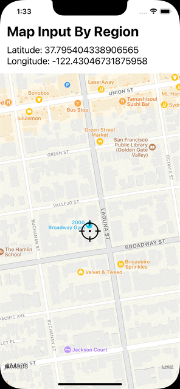

# React Native Map Input

A React Native Component for Getting Location using a Map

<center>
  
  
</center>

### Installation

```sh
yarn add react-native-map-input
```

or

```sh
npm install react-native-map-input --save
```

#### You have to install:

- [react-native-maps](https://github.com/react-native-maps/react-native-maps/blob/master/docs/installation.md)
- [react-native-svg](https://github.com/react-native-svg/react-native-svg#installation)

### Example

1. Usage with basic React state

   ```jsx
   import React, { useState } from 'react';
   import MapInput, { MapInputVariant } from 'react-native-map-input';

   const MyForm = () => {
     const [coordinate, setCoordinate] = useState({
       latitude: 37.78825,
       longitude: -122.4324,
       latitudeDelta: 0.0922,
       longitudeDelta: 0.0421,
     });

     return (
       // ...
       <MapInput
         region={coordinate}
         onChange={setCoordinate}
         variant={MapInputVariants.BY_REGION} {/* or BY_MARKER if you want */}
       />
       // ...
     );
   };
   ```

2. Usage with Formik

   ```jsx
   import React from 'react';
   import { Formik } from 'formik';
   import FormikMapInput from 'react-native-map-input/FormikMapInput';

   const initialValues = {
     // ...
     location: {
       latitude: 37.78825,
       longitude: -122.4324,
       latitudeDelta: 0.0922,
       longitudeDelta: 0.0421,
     },
     // ...
   };

   const MyForm = () => {
     const handleSubmit = (data) => {
       console.log(data.location);
     };

     return (
       <Formik initialValues={initialValues} onSubmit={handleSubmit}>
         {() => (
           // ...
           <FormikMapInput
             name="location"
             variant={MapInputVariants.BY_REGION} {/* or BY_MARKER if you want */}
           />
           // ...
         )}
       </Formik>
     );
   };
   ```
